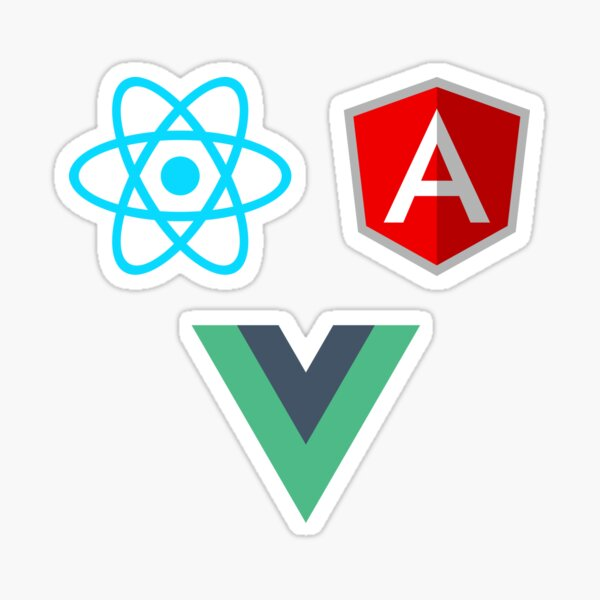

  
   
  <h1>Coders Hub Back-End</h1>
  <h3>The Coders Hub Back-End project is a Ruby on Rails API that allows users to book an appointment for coding classes. </h3>

### ERD diagram

## About the Project
The Coders Hub Back-End project is a Ruby on Rails API that allows users to book an appointment for coding classes. It includes user authentication and authorization using the Doorkeeper gem, which ensures that users must be authenticated before accessing protected resources.

### Built With

- Ruby On Rails
- PostgreSQL

## Getting Started

To get a local copy up and running, follow these steps:

### Prerequisites

To run this project, you'll need to install:

- Ruby 2.7.0 or later
- Rails 6.0 or later
- PostgreSQL

### Installation

1. Clone this repository to your desired folder:

`git@github.com:Cluab/Book-An-Appointment-Back-End.git`

`cd Book-An-Appointment-Back-End`

2. Install the required gems:

`bundle install`

3. Set up the database:

`rails db:create`

`rails db:migrate`

### Usage

To run the project, execute the following command:

`rails s`

### Deployment

You can deploy this project using:

- Heroku
- AWS Elastic Beanstalk
- Other cloud hosting providers

## Authors

👤 **Ibrahim Suhail Al-Yousefi**

- GitHub: [@cluab](https://github.com/Cluab)
- Twitter: [@cluab122](https://twitter.com/cluab122)
- LinkedIn: [Ebrahim Al-Yousefi](https://www.linkedin.com/in/ebrahim-alyousefi/)
- Instagram: [@27.i.b](https://www.instagram.com/27.i.b/)

👤 **Mancoba Sihlongonyane**

- GitHub: [@manq2010](https://github.com/manq2010/)
- Twitter: [@mancoba_c](https://twitter.com/mancoba_c/)
- LinkedIn: [mancobasihlongonyane](https://linkedin.com/in/mancobasihlongonyane/)

👤 **Krishna Prasad Acharya**

- GitHub: [@krishnabot](https://github.com/Krishnabot)
- Twitter: [@last_matrix](https://twitter.com/last_matrix)
- LinkedIn: [@Krishnabot](https://www.linkedin.com/in/krishnabot/)

👤 **Frehiywot Nega**

- GitHub: [@frnega](hhttps://github.com/frnega)
- Twitter: [@twitter](https://twitter.com/twitter)
- LinkedIn: [@frehiywot-nega](https://www.linkedin.com/in/frehiywot-nega/)

👤 **Idrissa makoba omar**

- GitHub: [omarbabou](https://github.com/omarbabou)
- LinkedIn: [Idrissa makoba omar](https://www.linkedin.com/in/idrissa-makoba-omar/)
- twitter: [BabouOmar3](https://twitter.com/BabouOmar3)

## Future Features

- Add user email confirmation

## Usage

_For more Info on how to use the API, please refer to the [Coders Hub API Documentation](https://coders-hub.onrender.com/documentation/authentication)_

## Kanban board

👉 [Kanban board link](https://github.com/Cluab/Book-An-Appointment-Back-End/projects/1)

👉 [Kanban board Development link](https://github.com/Cluab/Book-An-Appointment-Back-End/issues/21)

👉 This project was authored by <a href="#authors">Four contributors</a> as described in the the Authors section bellow.

👉 Please use this [link](https://github.com/manq2010/Book-An-Appointment-Front-End) to go to the front-end part of this project.

## Contributing

Contributions are what make the open source community such an amazing place to learn, inspire, and create. Any contributions you make are **greatly appreciated**.

Please, take a look at [open issues](https://github.com/Cluab/Book-An-Appointment-Back-End/issues) for a full list of proposed features (and known issues).

If you have a suggestion that would make this better, please fork the repo and create a pull request. You can also simply open an issue with the tag "enhancement".

Don't forget to give the project a star! Thanks again!

1. Fork the Project
2. Create your Feature Branch (`git checkout -b feature/AmazingFeature`)
3. Commit your Changes (`git commit -m 'Add some AmazingFeature'`)
4. Push to the Branch (`git push origin feature/AmazingFeature`)
5. Open a Pull Request

Contributions, issues, and feature requests are welcome! Feel free to check the [issues page](https://github.com/Cluab/hello-rails-back-end/issues).

## Show Your Support

Give a ⭐️ if you like this project!

## Acknowledgements

- [Microverse](https://www.microverse.org/) for providing the education that inspired this project.
- [RailsGuides](https://guides.rubyonrails.org/) for the excellent documentation on Ruby on Rails.
- Original design by [Murat Korkmaz](https://www.behance.net/muratk)

## License

This project is licensed under the MIT License - see the [LICENSE](./LICENSE) file for details.
